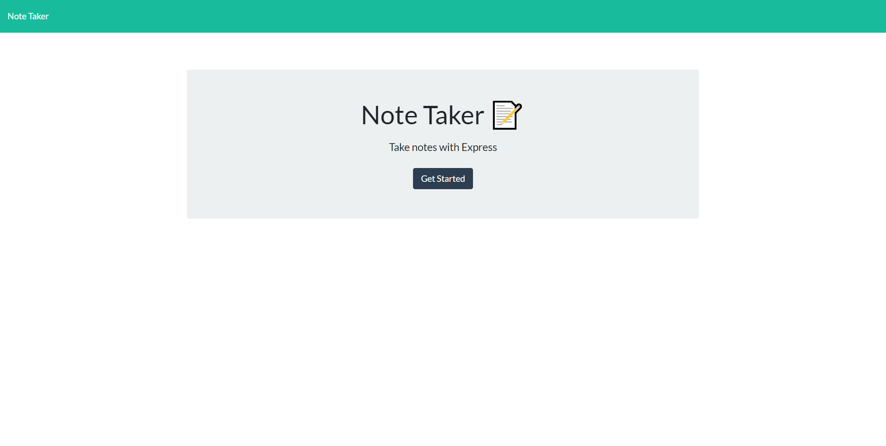
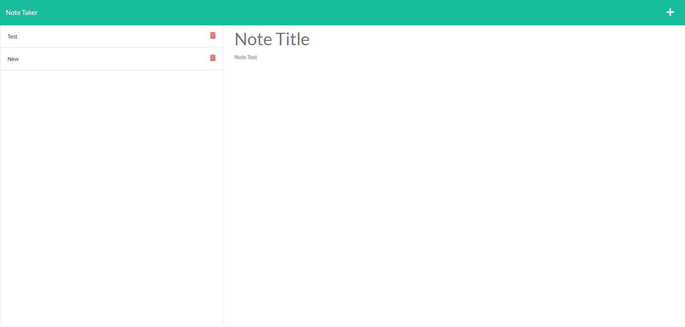

# Note Taker

## Table of Contents

1. [Description](#description)
2. [Usage](#usage)
3. [Visuals](#visuals)
4. [Resources](#resources)

## Description

A program built from existing code that utilizes express.js and heroku to deploy a server that hosts a note taking app.

Features include:

- An index.html landing page that links to the notes page.
- Existing notes in a lefthand column and righthand column where user can write new notes.
- Clicking on an existing note will display it in the righthand column.
- Saving a note will insert it to the lefthand column.
- Clicking on a trash can beside a saved note will delete that note.
- Saved notes will be assigned unique ids.

## Usage

Upon hitting the landing page, user can click 'Get Started' to launch the notes page. The server will then display served example notes on the left and an open column on the right to enter a new note. If the user clicks on one of the lefthand saved notes, it will display on the right. If user clicks on the + sign, user can enter new note. After new note is populated with a title and text, the save icon will appear. User can click that icon to save the note with a unique id to the server. If the user clicks on a trash can beside a note, that note will be deleted.

## Visuals

The landing page before clicking into the notebook.

The notebook view.

## Resources

- [Repository](https://github.com/kleylakb89/11-note-taker)
- [Heroku Site](https://damp-sierra-92977.herokuapp.com/)